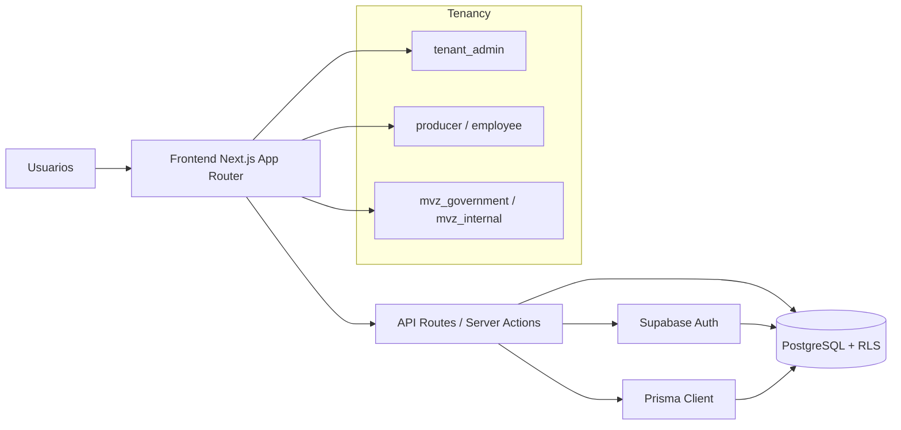

# Durania

[](#licencia)
[](https://nextjs.org)
[](https://react.dev)
[](https://www.typescriptlang.org)
[](https://supabase.com)
[](https://www.postgresql.org)
[](https://www.prisma.io)
[](https://vitest.dev)

<p align="left">
	
</p>

Durania es una plataforma web multi-tenant para gestion sanitaria y operativa del sector pecuario. Esta implementada con Next.js (App Router), Supabase Auth y PostgreSQL, y organiza la experiencia por perfiles y permisos dentro de cada tenant.

## Objetivo del proyecto

Centralizar en una sola aplicacion los flujos de:

- administracion institucional
- gestion de productores y su operacion diaria
- seguimiento veterinario MVZ
- auditoria y trazabilidad de cambios

## Arquitectura funcional

La aplicacion expone paneles por tipo de usuario:

- Admin: rol `tenant_admin`
- Producer: roles `producer`, `employee`
- MVZ: roles `mvz_government`, `mvz_internal`

La autorizacion combina contexto de tenant, rol y permisos de modulo. La persistencia se apoya en PostgreSQL con politicas RLS y funciones/triggers para flujos de autenticacion y provisionamiento.

## Vista grafica de arquitectura



## Stack tecnico

- Next.js 16 (App Router)
- React 19
- TypeScript
- Supabase (`@supabase/supabase-js`, `@supabase/ssr`)
- PostgreSQL
- Prisma Client
- Vitest para pruebas
- ESLint para analisis estatico

## Requisitos

- Node.js 20 o superior
- npm
- Proyecto Supabase accesible

## Inicio rapido

1. Instala dependencias:

```bash
npm install
```

2. Crea archivo `.env` en la raiz del proyecto.

3. Configura variables de entorno:

```env
NEXT_PUBLIC_SUPABASE_URL=
NEXT_PUBLIC_SUPABASE_ANON_KEY=
NEXT_PUBLIC_SITE_URL=http://localhost:3000
SUPABASE_SERVICE_ROLE_KEY=
DATABASE_URL=
DATABASE_URL_DIRECT=
DEFAULT_TENANT_SLUG=
```

4. Ejecuta migraciones SQL en el orden documentado.

5. Levanta la aplicacion:

```bash
npm run dev
```

6. Abre en navegador:

```text
http://localhost:3000
```

## Setup de base de datos (orden recomendado)

Ejecuta estos scripts SQL de forma secuencial:

1. `sql/migration_001_duraniaMVP.sql`
2. `sql/migration_002_mvz_hierarchy.sql`
3. `sql/migration_003_fix_rls_politicies.sql`
4. `sql/migration_004_settings_profile_split.sql`
5. `sql/migration_005_mvz_settings_permissions_backfill.sql`
6. `sql/migration_006_tenant_custom_roles.sql`
7. `sql/migration_007_add_iot_telemetry_tables.sql`
8. `sql/migration_008_allow_multiple_mvz_profiles_per_tenant.sql`
9. `sql/migration_009_alter_telemetry_rssi_snr_to_float8.sql`
10. `sql/migration_010_animals_backfill_and_collar_link.sql`
11. `sql/views.sql`
12. `sql/seeds.sql`

Validaciones recomendadas despues de migrar:

- trigger `on_auth_user_created` activo en `auth.users`
- tenant inicial disponible y activo
- redirect URLs de Supabase incluyendo `http://localhost:3000/**`
- plantillas de email de Supabase alineadas a `/auth/set-password`

## Scripts disponibles

```bash
# desarrollo
npm run dev

# build de produccion
npm run build
npm run start

# calidad
npm run lint
npm run typecheck
npm run test
npm run test:unit
npm run test:integration

# utilidades
npm run prisma:generate
npm run check:ui-colors
```

## Verificacion post-setup

Ejecuta estas comprobaciones minimas:

1. `GET /api/health` responde `ok`.
2. `GET /api/tenant/resolve` retorna `tenantSlug`.
3. Login con `tenant_admin` redirige a `/admin`.
4. Login con perfil MVZ redirige a `/mvz/dashboard`.

## Mapa de rutas

### Publico

- `/`
- `/login`

### Admin

- `/admin`
- `/admin/producers`
- `/admin/producers/new`
- `/admin/mvz`
- `/admin/mvz/new`
- `/admin/quarantines`
- `/admin/exports`
- `/admin/normative`
- `/admin/audit`
- `/admin/appointments`

### Producer

- `/producer/dashboard`
- `/producer/ranchos`
- `/producer/bovinos`
- `/producer/movilizacion`
- `/producer/exportaciones`
- `/producer/documentos`
- `/producer/empleados`

### MVZ

- `/mvz/dashboard`
- `/mvz/asignaciones`
- `/mvz/pruebas`
- `/mvz/exportaciones`

## API por dominio

### Auth y Tenant

- `GET /api/auth/me`
- `POST /api/auth/login`
- `POST /api/auth/logout`
- `GET /api/tenant/resolve`

### Admin

- `GET /api/admin/dashboard`
- `GET|POST|PATCH /api/admin/producers`
- `POST /api/admin/producers/batch`
- `GET|POST|PATCH /api/admin/mvz`
- `POST /api/admin/mvz/batch`
- `GET|POST|PATCH /api/admin/quarantines`
- `GET|POST|PATCH /api/admin/exports`
- `GET|POST|PATCH /api/admin/normative`
- `GET /api/admin/audit`
- `GET|PATCH /api/admin/appointments`

### Producer

- `GET /api/producer/dashboard`
- `GET /api/producer/upp`
- `GET|POST /api/producer/bovinos`
- `GET|POST /api/producer/movements`
- `GET|POST /api/producer/exports`
- `GET|POST|PATCH /api/producer/documents`
- `GET|POST|PATCH /api/producer/employees`

### MVZ

- `GET /api/mvz/dashboard`
- `GET /api/mvz/assignments`
- `GET|POST /api/mvz/tests`
- `POST /api/mvz/tests/sync`
- `GET|PATCH /api/mvz/exports`

### Public

- `POST /api/public/appointments`

## Estructura general del repositorio

- `src/app`: rutas UI y API (App Router)
- `src/modules`: modulos por dominio de negocio
- `src/server`: servicios backend, authz, db, middleware
- `prisma`: esquema y generacion de cliente
- `sql`: migraciones, vistas y seeds
- `tests`: pruebas unitarias e integracion
- `docs`: arquitectura, guias y referencia funcional

## Documentacion complementaria

- `docs/guides/setup.md`: setup canonico y checklist de entorno
- `docs/architecture/overview.md`: vista general de arquitectura
- `docs/data/database.md`: modelo y criterios de datos
- `docs/security/security.md`: lineamientos de seguridad

## Troubleshooting rapido

- Si el login funciona pero los paneles cargan vacios, verifica que se ejecuto `sql/migration_003_fix_rls_politicies.sql`.
- Si MVZ no permite multiples perfiles por tenant, verifica `sql/migration_008_allow_multiple_mvz_profiles_per_tenant.sql`.
- Si hay errores de redirect en auth, revisa `NEXT_PUBLIC_SITE_URL` y los Redirect URLs configurados en Supabase.

## Licencia

Este repositorio es de uso privado y propietario.

- No es software open source.
- No se autoriza copia, redistribucion ni publicacion total o parcial sin permiso expreso por escrito del propietario.
- El acceso al codigo fuente se limita a personal y colaboradores autorizados.
- Cualquier uso fuera del alcance contractual o interno se considera no permitido.
