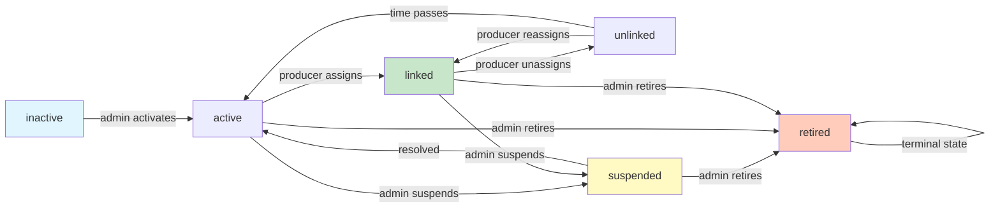

Status: Draft
Owner: Backend Engineering
Last Updated: 2026-03-29
Source of Truth: Cross-actor capability for IoT collar provisioning, assignment, and trazabilidad.

# Gestión de Collares IoT - Arquitectura Detallada

## Resumen Ejecutivo

El módulo `src/modules/collars/` implementa un sistema completo de gestión de collares IoT (dispositivos de telemetría para ganado) con soporte para:

- **Provisión de collares**: Administradores crean inventario de collares con estado inicial inactivo
- **Asignación dinámica**: Productores asignan/desasignan collares a animales por rancho (UPP)
- **Trazabilidad inmutable**: Todas las operaciones registradas en `collar_animal_history` para auditoría
- **Multi-tenancia estricta**: Aislamiento total entre tenants a nivel de query
- **Control de acceso UPP**: Productores solo pueden asignar collares a animales en sus ranchos autorizados
- **Máquina de estados**: Transiciones validadas entre 6 estados de collar

**Casos de uso:**
1. Admin: `POST /api/admin/collars` → Provisiona N collares (estado: inactivo)
2. Producer: `GET /api/producer/collars` → Lista collares disponibles (estado: activo, unlinked)
3. Producer: `POST /api/producer/collars/{id}/assign` → Vincula collar a bovino
4. Producer: `POST /api/producer/collars/{id}/unassign` → Desvincula collar
5. Producer: `GET /api/producer/collars/{id}/history` → Auditoría completa del collar

---

## Modelo de Dominio

### Entidades

#### `Collar`
```typescript
interface Collar {
  id: string;                          // UUID (clave primaria)
  tenant_id: string;                   // FK (multi-tenancy)
  collar_id: string;                   // Identificador de negocio (único por tenant)
  animal_id: string | null;            // FK a bovinos.id (cuando estélinked)
  status: CollarStatus;
  firmware_version?: string;           // p.ej. "v1.2.3"
  battery_level?: number;              // 0-100 (proveniente de telemetría)
  linked_at?: DateTime;
  unlinked_at?: DateTime;
  created_at: DateTime;
  updated_at: DateTime;
}

type CollarStatus = 
  | "inactive"    // Recién provisionado, sin usar
  | "active"      // Listo para asignación
  | "linked"      // Asignado a un animal
  | "unlinked"    // Previamente linked, ahora disponible
  | "suspended"   // Problema detectado (batería baja, falla, etc.)
  | "retired";    // Fuera de servicio (permanente)
```

#### `CollarAnimalHistory`
```typescript
interface CollarAnimalHistory {
  id: string;                    // UUID
  collar_id: string;             // FK (immutable)
  animal_id: string;             // FK (bovino vinculado en este evento)
  tenant_id: string;             // Desnormalizado para query eficiente
  linked_by: string | null;      // FK profiles.id (quién realizó el link)
  unlinked_by: string | null;    // FK profiles.id (quién realizó el unlink)
  linked_at: DateTime;           // Cuándo se asignó
  unlinked_at: DateTime | null;  // Cuándo se desasignó (null si aún está linked)
  notes?: string;                // Razón de asignación
  reason?: string;               // Razón de desasignación
  created_at: DateTime;
}
```

---

## Máquina de Estados



### Transiciones Válidas

| De       | A             | Notas                                           |
| -------- | ------------- | ----------------------------------------------- |
| inactive | active        | Admin activates collar for use                  |
| active   | linked        | Producer assigns to animal                      |
| active   | suspended     | Admin marks as faulty (battery, hardware issue) |
| active   | retired       | Admin removes from inventory                     |
| linked   | unlinked      | Producer unassigns from animal                  |
| linked   | suspended     | Admin marks as faulty                           |
| linked   | retired       | Admin removes from inventory                     |
| unlinked | linked        | Producer reassigns to different animal          |
| unlinked | suspended     | Admin marks as faulty                           |
| unlinked | retired       | Admin removes from inventory                     |
| suspended| active        | Admin confirms repair/resolution                |
| retired  | (none)        | Terminal state; no outbound transitions         |

**Validación implementada:**
- `isValidStatusTransition(current, next)` en `src/modules/collars/domain/entities/Collar.ts`
- Usada por `collarLinkingService.validateStatusChange()` en handlers/use-cases
- Rechaza transiciones inválidas con status code 409 (Conflict)

---

## Arquitectura en Capas

### Layer 1: Domain (Independencia)
**Ubicación:** `src/modules/collars/domain/`

```text
domain/
  entities/
    Collar.ts              → Interface + CollarStatus type + validator
    CollarAnimalHistory.ts → Interface
    CollarStatus.ts        → Re-export convenience
  repositories/
    CollarRepository.ts    → ICollarRepository interface contract
  services/
    collarLinkingService.ts → Business logic (state transitions, validation)
```

**Responsabilidades:**
- Define entities (POJOs, no métodos, solo tipos)
- Implements collarLinkingService (pure functions, no I/O)
- Declares repository interface (abstraction)
- **Zero dependencias externas:** No Node.js, Supabase, o Next.js APIs

---

### Layer 2: Application (Orquestación)
**Ubicación:** `src/modules/collars/application/`

```text
application/
  dto/
    index.ts           → 6 DTOs (Provision, Assign, Unassign, UpdateStatus, Response, History)
  use-cases/
    ProvisionCollarToProducer.ts
    GetProducerCollarInventory.ts
    AssignCollarToAnimal.ts
    UnassignCollarFromAnimal.ts
    GetCollarDetail.ts
    ListCollarHistory.ts
```

**Responsabilidades:**
- Implements use case orchestration
- Validates DTOs early (payload contracts)
- Delegates to domain services (business rules)
- Calls repository (data access)
- **No HTTP concerns:** Agnostic to request/response format

**Use Case Pattern:**
```typescript
class AssignCollarToAnimal {
  constructor(private repository: ICollarRepository, 
              private linkingService: typeof collarLinkingService) {}

  async execute(collarId: string, dto: ProducerAssignCollarDTO) {
    const collar = await this.repository.findById(collarId);
    if (!collar) throw new NotFoundError();

    const { updatedCollar, historyEntry } = await this.linkingService.linkCollarToAnimal(
      collar, 
      dto.animal_id, 
      dto.linked_by, 
      dto.notes
    );

    await this.repository.save(updatedCollar);
    await this.repository.createHistoryEntry(historyEntry);

    return { collar: updatedCollar, history_entry: historyEntry };
  }
}
```

---

### Layer 3: Infrastructure (I/O)
**Ubicación:** `src/modules/collars/infra/`

#### 3a) Repository Implementation
**File:** `src/modules/collars/infra/supabase/ServerCollarRepository.ts`

```typescript
export class ServerCollarRepository implements ICollarRepository {
  constructor(
    private tenantId: string,
    private accessToken: string,
    private accessibleUppIds?: string[] // For producer scope filtering
  ) {}

  async findById(collarId: string): Promise<Collar | null> {
    return this.client
      .from("collars")
      .select("*")
      .eq("tenant_id", this.tenantId)  // ← Multi-tenancy filter
      .eq("id", collarId)
      .single();
  }

  async findUnassignedByTenant(limit = 50): Promise<Collar[]> {
    let query = this.client
      .from("collars")
      .select("*")
      .eq("tenant_id", this.tenantId)  // ← Multi-tenancy filter
      .in("status", ["active", "unlinked"])
      .limit(limit);

    if (this.accessibleUppIds?.length) {
      // ← Producer scope: only collars linked to animals in their UPPs
      query = query.in("animals.upp_id", this.accessibleUppIds);
    }

    return query;
  }

  async createHistoryEntry(entry: CollarAnimalHistory): Promise<CollarAnimalHistory> {
    return this.client
      .from("collar_animal_history")
      .insert({
        ...entry,
        tenant_id: this.tenantId  // ← Desnormalized for audit query efficiency
      })
      .single();
  }
}
```

**Multi-tenancy Strategy:**
- **Every query filtered by `tenant_id`** (no blind trusts)
- `accessibleUppIds` passed at instantiation for producer scope
- **Supabase RLS policies double-check** (defense in depth)

#### 3b) Mappers
**File:** `src/modules/collars/infra/mappers/collar.mapper.ts`

```typescript
export function toDomainCollar(row: Prisma.collarsGetPayload<{}>): Collar {
  return {
    id: row.id,
    tenant_id: row.tenant_id,
    collar_id: row.collar_id,
    animal_id: row.animal_id,
    status: row.status as CollarStatus,
    // ... other fields
  };
}

export function toApiCollar(collar: Collar): ApiCollarResponse {
  return {
    id: collar.id,
    collar_id: collar.collar_id,
    status: collar.status,
    animal_id: collar.animal_id,
    firmware_version: collar.firmware_version,
    linked_at: collar.linked_at?.toISOString(),
    // Strips: tenant_id (sensitive), created_at (admin-only)
  };
}
```

#### 3c) DI Container
**File:** `src/modules/collars/infra/container.ts`

```typescript
export function createCollarUseCases(
  tenantId: string,
  accessToken: string,
  accessibleUppIds?: string[]
) {
  const repository = new ServerCollarRepository(
    tenantId,
    accessToken,
    accessibleUppIds
  );

  return {
    provisionCollar: new ProvisionCollarToProducer(repository),
    getInventory: new GetProducerCollarInventory(repository),
    assignCollar: new AssignCollarToAnimal(repository, collarLinkingService),
    unassignCollar: new UnassignCollarFromAnimal(repository, collarLinkingService),
    getDetail: new GetCollarDetail(repository),
    getHistory: new ListCollarHistory(repository),
  };
}
```

**Why this pattern?**
- Tenants & UPP scope bound at request time (no global state)
- All use cases share same repository (consistent tenant filtering)
- Easy to mock repository for testing (dependency injection)

#### 3d) HTTP Handlers
**Files:**
- `src/modules/collars/infra/http/adminHandlers.ts` (3 handlers)
- `src/modules/collars/infra/http/producerHandlers.ts` (5 handlers)

**Handler Pattern:**
```typescript
export async function assignCollar(
  request: Request,
  { params }: { params: { id: string } }
) {
  const auth = await requireAuthorized(request, {
    roles: ["producer"],
    permissions: ["producer.collars.write"],
    resource: "producer.collars",
  });
  if (!auth.ok) return auth.response;

  const body = await request.json();

  const useCases = createCollarUseCases(
    auth.context.user.tenantId,      // ← Tenant bound at request time
    auth.context.user.accessToken,
    auth.context.accessibleUppIds    // ← UPP scope from auth context
  );

  try {
    const result = await useCases.assignCollar.execute(params.id, body);
    await logAuditEvent({
      action: "link_collar",
      collar_id: params.id,
      profile_id: auth.context.user.id,
      tenant_id: auth.context.user.tenantId,
      details: result
    });
    return apiSuccess({ success: true, ...result }, 200);
  } catch (error) {
    return apiError(error.code, error.message);
  }
}
```

**Responsibilities per Handler:**
1. Authenticate & authorize (roles + permissions)
2. Instantiate use cases with tenant/UPP context
3. Parse & validate request payload
4. Call use case
5. Log audit event
6. Return standardized API response

#### 3e) Frontend API Client
**File:** `src/modules/collars/infra/api/collaresApi.ts`

```typescript
export async function apiAssignCollar(
  collarId: string,
  animalId: string,
  linkedBy: string,
  notes?: string
): Promise<ApiAssignCollarResponse> {
  const response = await fetch(
    `/api/producer/collars/${collarId}/assign`,
    {
      method: "POST",
      headers: {
        "Content-Type": "application/json",
        Authorization: `Bearer ${await getAuthToken()}`, // ← Token injection
      },
      body: JSON.stringify({ animal_id: animalId, linked_by: linkedBy, notes }),
    }
  );

  if (!response.ok) {
    const error = await response.json();
    throw new Error(error.message);
  }

  return response.json();
}
```

**Props:**
- Wraps every endpoint the frontend needs
- Handles token injection automatically
- Parses errors consistently
- Type-safe via TS interfaces

---

## Route Entrypoints

All routes are thin wrappers that reexport from `src/modules/collars/infra/http/`:

```typescript
// src/app/api/admin/collars/route.ts
export { GET, POST, PATCH } from "@/modules/collars/infra/http/adminHandlers";

// src/app/api/producer/collars/[collarId]/assign/route.ts
export { assignCollar as POST } from "@/modules/collars/infra/http/producerHandlers";
```

**Why separate routes from business logic?**
- Routes are deployment/framework concerns (Next.js App Router)
- Handlers contain testable business logic
- Easy to run same handlers in different contexts (e.g., webhook handlers)

---

## API Contract

### Admin Endpoints

#### `POST /api/admin/collars` - Provision Collar
```http
Content-Type: application/json
Authorization: Bearer {admin_token}

{
  "collar_id": "COLLAR-FIELD-001",
  "firmware_version": "v1.2.3",
  "purchased_at": "2026-05-01T00:00:00Z"
}
```

**Response (201):**
```json
{
  "success": true,
  "collar": {
    "id": "uuid",
    "collar_id": "COLLAR-FIELD-001",
    "status": "inactive",
    "animal_id": null,
    "firmware_version": "v1.2.3",
    "created_at": "2026-02-27T10:00:00Z"
  }
}
```

---

#### `GET /api/admin/collars?status=active&limit=50` - List Collars
**Response (200):**
```json
{
  "success": true,
  "collars": [ ... ],
  "total": 150,
  "limit": 50
}
```

---

#### `PATCH /api/admin/collars/{collarId}` - Update Status
```json
{
  "status": "suspended",
  "reason": "Battery critically low"
}
```

---

### Producer Endpoints

#### `GET /api/producer/collars` - List Available Collars
**Response (200):**
```json
{
  "success": true,
  "collars": [
    {
      "id": "uuid",
      "collar_id": "COLLAR-FIELD-001",
      "status": "active",
      "firmware_version": "v1.2.3"
    }
  ]
}
```

---

#### `GET /api/producer/collars/{collarId}` - Get Detail
**Response (200):**
```json
{
  "success": true,
  "collar": {
    "id": "uuid",
    "collar_id": "COLLAR-FIELD-001",
    "status": "linked",
    "animal_id": "bovino-uuid",
    "linked_at": "2026-02-27T10:45:00Z"
  }
}
```

---

#### `POST /api/producer/collars/{collarId}/assign` - Assign to Animal
```json
{
  "animal_id": "bovino-uuid",
  "linked_by": "profile-uuid",
  "notes": "Asignado en inspección de rancho"
}
```

**Response (200):**
```json
{
  "success": true,
  "collar": {
    "id": "uuid",
    "collar_id": "COLLAR-FIELD-001",
    "status": "linked",
    "animal_id": "bovino-uuid",
    "linked_at": "2026-02-27T11:00:00Z"
  },
  "history_entry": {
    "linked_by": "profile-uuid",
    "linked_at": "2026-02-27T11:00:00Z",
    "animal_id": "bovino-uuid",
    "notes": "Asignado en inspección de rancho"
  }
}
```

---

#### `POST /api/producer/collars/{collarId}/unassign` - Unassign Collar
```json
{
  "unlinked_by": "profile-uuid",
  "reason": "Revisión de batería"
}
```

**Response (200):**
```json
{
  "success": true,
  "collar": {
    "id": "uuid",
    "collar_id": "COLLAR-FIELD-001",
    "status": "unlinked",
    "animal_id": null,
    "unlinked_at": "2026-02-27T12:00:00Z"
  },
  "history_entry": {
    "unlinked_by": "profile-uuid",
    "unlinked_at": "2026-02-27T12:00:00Z",
    "animal_id": "bovino-uuid",
    "reason": "Revisión de batería"
  }
}
```

---

#### `GET /api/producer/collars/{collarId}/history` - Audit Trail
**Response (200):**
```json
{
  "success": true,
  "history": [
    {
      "linked_by": "profile-uuid-001",
      "linked_at": "2026-02-27T10:45:00Z",
      "unlinked_by": null,
      "unlinked_at": null,
      "animal_id": "bovino-001",
      "notes": "Asignación inicial"
    },
    {
      "linked_by": null,
      "linked_at": "2026-02-27T10:45:00Z",
      "unlinked_by": "profile-uuid-001",
      "unlinked_at": "2026-02-27T12:00:00Z",
      "animal_id": "bovino-001",
      "reason": "Mantenimiento"
    }
  ],
  "total": 2
}
```

---

### Producer IoT Telemetry Proxy (UPP y Collar)

Adicional al inventario de collares, producer consume telemetria IoT mediante proxy interno autenticado:

- cliente externo server-side: `src/modules/collars/infra/api/external/iotAppWebClient.ts`
- handlers proxy internos: `src/modules/collars/infra/http/external/producerIotHandlers.ts`
- entrypoints delgados en `src/app/api/producer/upp/*/collars/*` y `src/app/api/producer/collars/*/iot/*`

Contratos expuestos internamente:

- `GET /api/producer/upp/{uppId}/collars/realtime`
- `GET /api/producer/upp/{uppId}/collars/history`
- `GET /api/producer/upp/{uppId}/collars/realtime/stream` (SSE)
- `GET /api/producer/upp/{uppId}/collars/realtime-stream` (alias de compatibilidad)
- `GET /api/producer/collars/{collarId}/iot/history`
- `GET /api/producer/collars/{collarId}/iot/realtime/stream` (SSE)

Reglas de seguridad aplicadas por los handlers:

- `requireAuthorized` con roles `producer` y `employee`
- permiso `producer.collars.read`
- validacion de ownership por UPP via `canAccessUpp` en endpoints a nivel rancho

Comportamiento SSE actual:

- proxy transparente del stream externo (content type `text/event-stream`)
- fallback en cliente frontend del stream UPP: intenta `/realtime/stream` y, ante `404`, usa `/realtime-stream`
- el frontend de detalle bovino mantiene modo respaldo por snapshot/historico cuando el stream falla

Variable de entorno obligatoria para este flujo:

- `IOT_BACKEND_URL`

---

## Seguridad & Cumplimiento

### Multi-Tenancy Enforcement
- **Layer 1 (Database):** Supabase RLS policies forbid cross-tenant queries
- **Layer 2 (Repository):** Every query includes `.eq("tenant_id", this.tenantId)`
- **Layer 3 (HTTP):** Auth middleware extracts tenantId from JWT; instantiates use cases scoped to tenant
- **Audit:** All operations logged with tenant_id for compliance

### UPP-Level Access Control
- Producer auth context includes `accessibleUppIds` array (UPP IDs they own/manage)
- Producer handlers pass this to DI container
- Repository filters to: unassigned collars + collars linked to animals in `accessibleUppIds`
- Assignment validates animal_id belongs to producer's UPP (if needed, can add explicit validation)

### Audit Trail (Trazabilidad)
- `collar_animal_history` table immutable (no delete/update)
- Every link/unlink operation creates entry with:
  - `linked_by` or `unlinked_by` (profile UUID of who did it)
  - Timestamps (`linked_at`, `unlinked_at`)
  - Reason/notes for traceability
  - `tenant_id` (desnormalized for efficient audit queries)
- Admin can query: `SELECT * FROM collar_animal_history WHERE tenant_id = ? ORDER BY linked_at DESC`

### Permission System
4 permissions registered in `permissions` table:
- `admin.collars.read` - List collars (provision inventory check)
- `admin.collars.write` - Provision, update status
- `producer.collars.read` - See available collars
- `producer.collars.write` - Assign/unassign

**Enforcement:**
```typescript
const auth = await requireAuthorized(request, {
  roles: ["producer"],
  permissions: ["producer.collars.write"],
  resource: "producer.collars",
});
```

---

## Notas Operativas

### Database Requirements
Ensure these tables & indexes exist:
```sql
-- Tables (schema.prisma)
CREATE TABLE collars { ... };
CREATE TABLE collar_animal_history { ... };

-- Indexes
CREATE INDEX idx_collars_tenant_id ON collars(tenant_id);
CREATE INDEX idx_collars_status ON collars(status);
CREATE INDEX idx_collars_animal_id ON collars(animal_id);
CREATE INDEX idx_collar_history_collar_id ON collar_animal_history(collar_id);
CREATE INDEX idx_collar_history_tenant_id ON collar_animal_history(tenant_id);

-- RLS Policies
ALTER TABLE collars ENABLE ROW LEVEL SECURITY;
ALTER TABLE collar_animal_history ENABLE ROW LEVEL SECURITY;
```

### Known Limitations & TODOs
1. **Atomicity**: `updateCollarStatus() + createHistoryEntry()` are separate DB calls. Should wrap in transaction for consistency.
2. **Validation**: `animal_id` existence not verified before assignment (relies on FK constraint). Consider adding explicit check.
3. **Admin Handlers**:
   - GET status filtering not implemented (marked TODO in code)
   - PATCH update logic incomplete (marked TODO in code)
4. **Performance**: No caching; each list operation queries DB. Consider in-memory cache for unassigned collars if N > 10K.

### Testing
- Run integration tests: `npm run test -- tests/modules/collars/collar-management.integration.test.ts`
- See `docs/guides/collar-management-testing.md` for full testing checklist (60+ test cases)
- Manual curl/Postman testing recommended before production deployment

### Deployment Checklist
1. [ ] Run `prisma migrate` to ensure collar tables exist
2. [ ] Run `/sql/migration_011_add_collars_permissions.sql` to register permissions
3. [ ] Assign permissions to admin & producer tenant roles via admin UI
4. [ ] Run integration tests (pass 100%)
5. [ ] Deploy to staging, run smoke tests
6. [ ] Deploy to production with monitoring for errors in `logAuditEvent` calls
7. [ ] Verify audit trail in `collar_animal_history` after first real operations

---

## Referencia de Archivos

### Core Domain
- `src/modules/collars/domain/entities/Collar.ts` (34 LOC)
- `src/modules/collars/domain/entities/CollarAnimalHistory.ts` (9 LOC)
- `src/modules/collars/domain/services/collarLinkingService.ts` (73 LOC)

### Application
- `src/modules/collars/application/use-cases/` (6 files, ~150 LOC)
- `src/modules/collars/application/dto/index.ts` (48 LOC)

### Infrastructure
- `src/modules/collars/infra/supabase/ServerCollarRepository.ts` (211 LOC)
- `src/modules/collars/infra/http/adminHandlers.ts` (138 LOC)
- `src/modules/collars/infra/http/producerHandlers.ts` (167 LOC)
- `src/modules/collars/infra/api/collaresApi.ts` (183 LOC)
- `src/modules/collars/infra/container.ts` (25 LOC)

### Tests
- `tests/modules/collars/collar-management.integration.test.ts` (200+ LOC)
- `docs/guides/collar-management-testing.md` (comprehensive checklist)

**Total:** ~1400 LOC domain + application + infrastructure

---

## Cambios Futuros Sugeridos

1. **Telemetría Real-Time**
   - Conectar a `telemetry` table; sync collar battery, RSSI, SNR
   - Auto-suspend collars con battery < 5%
   - Dashboard para health check

2. **Reassignment Automation**
   - When animal moved to different UPP, auto-unlink old collar
   - Suggest reassignment to available collar in new UPP

3. **Firmware OTA Updates**
   - Track firmware_version; auto-prompt producers to update
   - Version matrix: Device serial → target firmware

4. **Collar Lifecycle Tracking**
   - Cost allocation per collar (purchase, maintenance)
   - Depreciation schedule

5. **Bulk Operations**
   - Batch provision (import CSV of 100+ collars)
   - Batch reassign across herd

---

## Contacto & Soporte

**Backend Owner:** Engineering
**Last Review:** 2026-02-27
**Code Review:** Required for changes to domain/ or infra/
**Questions?** See `docs/architecture/README.md` for escalation path
